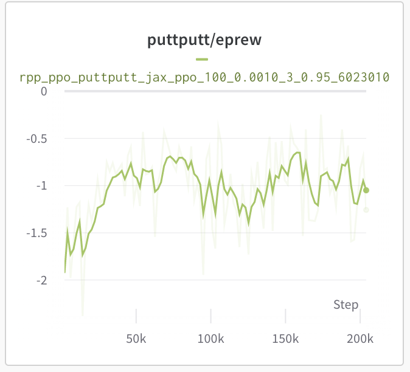

## Minimal PPO implementation for RPP (MiniPPO)

The RPP benchmark comes with standard RL baselines, most notably Proximal Policy Optimization (PPO).

We provide a two implementations of PPO: a parallelized PPO built on top of Ray RLLIB (Pytorch), as well as a minmalistic one in Jax (MiniPPO).

## Running MiniPPO on RPP

To run MiniPPO on a sample RPP task, execute the following command:

```
python train_ppo.py --env_name=puttputt --train_steps=10_000_000 --n_steps=50 \
--lr=0.001 --epoch_ppo=3 --gae_lambda=0.95\
--entropy_coeff=0.01 --max_grad_norm=2 --rpp_n_objects=1 \
--rpp_n_tiles=1 --rpp_n_golfballs=1 --rpp_n_goals=1 \
--run_id=test_run \
--wandb_key=<YOUR_W&B_KEY>\
--wandb_entity=<YOUR_W&B_USERNAME_OR_TEAM>\
--wandb_project=<YOUR_W&B_PROJECT_NAME>\
--wandb_mode=online
```

The results are directly logged into a [Weights & Biases](https://wandb.ai/) dashboard (either online or offline), but the code is easily adaptable to use either tensorboard logging or a simple CSV file.

## RPP task config + results
We have tested MiniPPO on the following task configuration:
```
sim = Simulator(state_buffer_length=20)
visual_config = get_env_config('visual', 'cifar_linear', dist_name='close')
stacked_class = make_stacked_observation(RGBObservation, n_stack=20)
rgb_obs = stacked_class(resolution=256, config=visual_config)

init_config = get_env_config('initialization', 'puttputt', 'random_middle')
init_config[Numbers.Object] = dist.DiscreteRange(1, 2)
init_config[Numbers.Tile] = dist.DiscreteRange(1, 2)
init_config[Numbers.Golfball] = 1
init_config[Numbers.Goal] = 1
init_config[Positions.Object] = ArenaLocation.Edge
init_config[Positions.Tile] = ArenaLocation.TopLeft
init_config[Positions.Golfball] = ArenaLocation.BottomRight
init_config[Positions.Goal] = ArenaLocation.TopLeft

initialization = PuttPuttInitialization(config=init_config)

config =  dict(max_steps_per_episode=100,
               episodes_per_arena=1,
               sub_steps=20)
task = PuttPutt(initialization=initialization, action_range=[-1, 1])
``` 
It is important to restrict the action_range parameter to a small enough interval to prevent the agent from applying a force too large (similar to MuJoCo). To enforce this on PPO side, the diagonal Gaussian policy is clipped with a Tanh transform.

The plot of returns over training frames is shown below:

